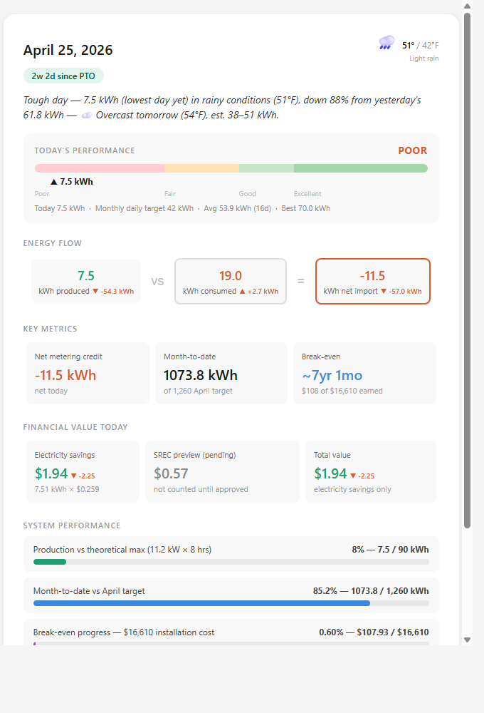
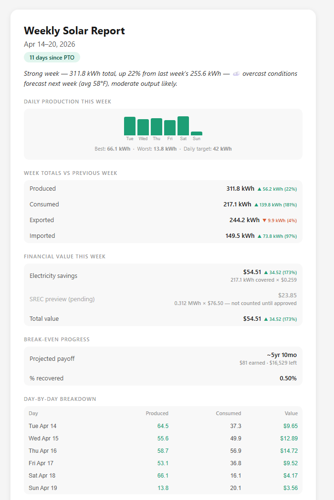
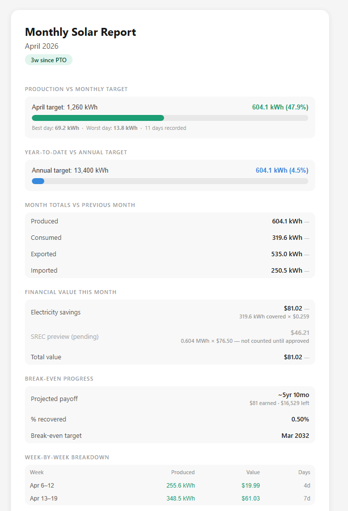

# Solar Report

A daily solar monitoring system for Enphase solar installations. Fetches production and consumption data from the Enphase Enlighten API v4, stores it in a local SQLite database, generates HTML reports, and sends a daily email digest via [Resend](https://resend.com).

---

## Features

### Daily Email Report
Sent every morning at 5am covering the previous day.



- **Headline summary** — punchy one-sentence digest: today's rating + weather context + % change vs yesterday + tomorrow's forecast (e.g. *"Tough day — 13.8 kWh in rainy conditions (52°F), down 79% from yesterday's 66.1 kWh — ☁️ overcast forecast tomorrow (50°F) will cap output."*)
- **Weather** — daily high/low and conditions in the top-right corner (Open-Meteo, no key required)
- **Performance meter** — colour-banded gauge rating production as Poor / Fair / Good / Excellent vs. monthly daily target
- **Energy flow** — produced vs. consumed with net export/import
- **Change indicators** — every metric shows ▲/▼ vs. the previous day, colour-coded so "up" is always good (more consumption = red, more production = green)
- **Key metrics** — net metering credit, month-to-date production, break-even timeline
- **Financial value** — electricity savings at retail rate; SREC preview shown but excluded from totals until approved
- **System performance bars**
  - Production vs. theoretical max
  - Month-to-date vs. monthly target
  - Break-even progress
  - **Net metering bank** — cumulative kWh and dollar value banked since PTO, with days-of-coverage estimate

### Weekly Report
Sent every Monday at 6:00 AM covering the previous week.



- **Headline summary** — one-sentence digest with week-over-week comparison and next-week weather forecast
- Sparkline bar chart of daily production
- Week totals vs previous week with change indicators
- Financial value with SREC preview greyed out
- Break-even progress
- Day-by-day breakdown table

### Monthly Report
Sent on the 1st of each month at 6:30 AM covering the previous month.



- Production vs monthly target progress bar
- Year-to-date vs annual target
- Month totals vs previous month with change indicators
- Financial value with SREC preview greyed out
- Break-even progress with projected payoff date
- Week-by-week breakdown table
- All periods clamped to PTO date — no pre-solar zeroes skew the data

### Break-Even Projection
- Year-by-year compound model with 3% annual electricity rate escalation
- Based on actual PSEG bill history (13 months of bills)
- Updates daily as real earnings accumulate

---

## Architecture

```
solar_report.py          ← daily orchestrator (fetch → save → report → email)
├── enphase_api.py       ← Enphase Enlighten API v4 (OAuth2 + auto token refresh)
├── database.py          ← SQLite via sqlite3 (idempotent writes, cumulative counters)
├── report_builder.py    ← full HTML report (CSS layout, performance meter, payoff table)
├── email_builder.py     ← email-safe HTML (table layout, inline styles, weather widget)
└── send_email.py        ← Resend API delivery

weekly_report.py         ← weekly summary report + email
monthly_report.py        ← monthly summary report + email
```

---

## Setup

### Prerequisites
- Python 3.11+
- Enphase Enlighten developer account ([register here](https://developer-v4.enphase.com/))
- [Resend](https://resend.com) account (free tier: 100 emails/day)

### Install dependencies
```bash
pip install requests resend
```

### Configure
Copy `config.example.json` to `config.json` and fill in your values:

```bash
cp config.example.json config.json
```

| Key | Description |
|---|---|
| `client_id` / `client_secret` | Enphase OAuth2 app credentials |
| `api_key` | Enphase API key |
| `system_id` | Your Enphase system ID |
| `access_token` / `refresh_token` | OAuth2 tokens (auto-refreshed) |
| `pseg_rate` | Combined delivery + supply rate ($/kWh) from your latest bill |
| `pseg_delivery_rate` | Delivery component (for reference) |
| `pseg_supply_rate` | Supply component — update quarterly as PSEG adjusts rates |
| `pseg_fixed_monthly` | Fixed monthly service charge (solar doesn't eliminate this) |
| `srec_rate` | SREC value in $/MWh (NJ: $76.50) |
| `net_cost` | Net system cost after incentives ($) |
| `annual_target_kwh` | Expected annual production from installer estimate |
| `email_from` | Resend sender address |
| `email_to` | Recipient address |
| `resend_api_key` | Resend API key |
| `latitude` / `longitude` | Your location for weather data |

### Initialise the database
```bash
python database.py
```

### Run manually
```bash
# Yesterday's report (default)
python solar_report.py

# Specific date
python solar_report.py 2026-04-18

# Weekly report
python weekly_report.py

# Monthly report
python monthly_report.py
```

---

## Scheduled Tasks (Windows)

Three scheduled tasks run automatically. To register them:

### Daily — 5:00 AM
```powershell
$action  = New-ScheduledTaskAction -Execute "python" -Argument "C:\dev\solar-report\solar_report.py" -WorkingDirectory "C:\dev\solar-report"
$trigger = New-ScheduledTaskTrigger -Daily -At "05:00"
Register-ScheduledTask -TaskName "SolarDailyReport" -Action $action -Trigger $trigger -RunLevel Highest
```

### Weekly — Monday 6:00 AM
```powershell
$action  = New-ScheduledTaskAction -Execute "python" -Argument "C:\dev\solar-report\weekly_report.py" -WorkingDirectory "C:\dev\solar-report"
$trigger = New-ScheduledTaskTrigger -Weekly -DaysOfWeek Monday -At "06:00"
Register-ScheduledTask -TaskName "SolarWeeklyReport" -Action $action -Trigger $trigger -RunLevel Highest
```

### Monthly — 1st of month, 6:30 AM
```powershell
schtasks /create /tn "SolarMonthlyReport" /tr "python C:\dev\solar-report\monthly_report.py" /sc monthly /d 1 /st 06:30 /rl highest /f
```

---

## Electricity Rate Updates

Your PSEG supply rate changes quarterly. When a new bill arrives:
1. Check the supply rate ($/kWh) on the bill
2. Update `pseg_supply_rate` and `pseg_rate` (delivery + supply) in `config.json`
3. Re-run historical dates to recalculate savings — or update the DB directly:

```python
import database, json
from pathlib import Path

NEW_RATE = 0.2586  # update this
cfg = json.loads(Path("config.json").read_text(encoding="utf-8-sig"))
conn = database.get_conn()
rows = conn.execute("SELECT date, produced, consumed FROM daily_readings").fetchall()
for r in rows:
    kwh = min(r["produced"], r["consumed"])
    new_val = round(kwh * NEW_RATE, 4)
    conn.execute("UPDATE daily_readings SET electricity_savings=?, total_value=? WHERE date=?",
                 (new_val, new_val, r["date"]))
conn.commit()
conn.close()
```

---

## SREC Approval

Once you receive SREC approval, re-enable SREC income in `database.py`:

```python
# Change this line:
total_value = round(electricity_savings, 4)
# To:
total_value = round(electricity_savings + srec_earned, 4)
```

The SREC preview card in each report already shows the pending value so you know what to expect.

---

## Database Schema

```sql
daily_readings (
    date                TEXT PRIMARY KEY,
    produced            REAL,   -- kWh from solar
    consumed            REAL,   -- kWh total home consumption
    imported            REAL,   -- kWh net import from grid (derived)
    exported            REAL,   -- kWh net export to grid (derived)
    net                 REAL,   -- produced - consumed
    self_consumed       REAL,
    srec_earned         REAL,   -- daily SREC accrual
    electricity_savings REAL,   -- min(produced,consumed) × pseg_rate
    total_value         REAL    -- electricity_savings (+ srec_earned when approved)
)

cumulative (
    key   TEXT PRIMARY KEY,
    value REAL
    -- keys: lifetime_kwh, monthly_kwh, srec_progress_kwh, monthly_reset_month
)
```

---

## Notes

- **Rate limiting** — Enphase free tier allows ~10 API calls/minute. The client includes exponential backoff. When backfilling multiple days, add a 30-second gap between runs.
- **Token refresh** — OAuth2 access tokens are refreshed automatically and saved back to `config.json`.
- **Import/export accuracy** — Gross daily import and export require 15-minute interval data. The system uses `net = produced − consumed` and displays produced vs. consumed directly. This matches Enphase's reported totals exactly.
- **PTO date** — Set to your Permission To Operate date in `report_builder.py` (`PTO_DATE = "YYYY-MM-DD"`). All period calculations are clamped to this date.
